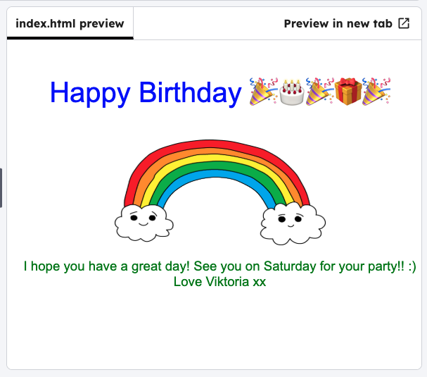

<h2 class="c-project-heading--task">Birthday message</h2>

Add your own `birthday-greeting` by replacing the code with your own text.

## Step 1

--- code ---
---
language: html
filename: index.html
line_numbers: true
line_number_start: 11
line_highlights: 12
---
      

        Happy Birthday 🎉🎂🎉🎁🎉
      

--- /code ---

## Step 2

Click **Run** and then the button on the front of the card, and check your new text is showing. 

### Tip

A tag is the label that shows what type of media it is. The `
` tag is short for **paragraph**, and `` is short for **image**.

## Now run your code

Click **Run**, then click the button on the front of the card, and check that your new text appears.
