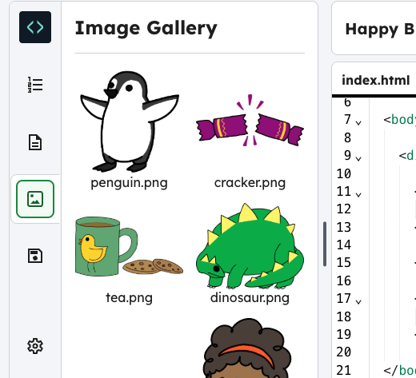
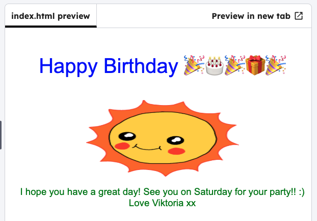

<h2 class="c-project-heading--task">Change the image</h2>

--- task ---

Edit the HTML code for the image. Replace the word `rainbow` with `sun` to change the picture.

--- /task ---

--- task ---

You can see all the images by clicking on the image gallery icon.

--- /task ---

--- code ---
---
language: html
filename: index.html
line_numbers: true
line_number_start: 11
line_highlights: 15
---
      

        Happy Birthday 🎉🎂🎉🎁🎉
      

      
      
--- /code ---

--- task ---

Click **Run** to see the image change.

--- /task ---

--- task ---

Experiment with other images. Try `boy`, `diamond`, `dinosaur`, `flowers`, `girl`, `rainbow`, `robot`, `spaceship`, `sun`, `tea`, or `trophy` for a birthday card, or `cracker`, `elf`, `penguin`, `present`, `reindeer`, `santa`, or `snowman` to make a Christmas card.

--- /task ---
