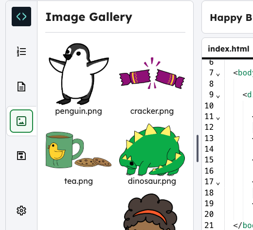
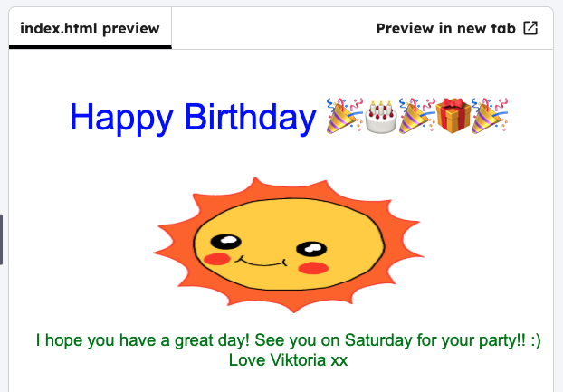

<h2 class="c-project-heading--task">Change the image</h2>

--- task ---

Edit the HTML code for the image. Replace the word `rainbow` with `sun` to change the picture.

--- /task ---

--- task ---

You can see all the images by clicking on the **image gallery** icon.

--- /task ---

--- task ---

Add the code below, and experiment with other images. For example, try `boy`, `rainbow`, `robot`, `present`, or `snowman`.

--- /task ---

--- code ---
---
language: html
filename: index.html
line_numbers: true
line_number_start: 11
line_highlights: 15
---
      

        Happy Birthday 🎉🎂🎉🎁🎉
      

      
      
--- /code ---

--- task ---

Click **Run** to see the image change.

--- /task ---

### Tip

`pic` is an **id**, a name you give to an HTML element so that you can style in CSS.

