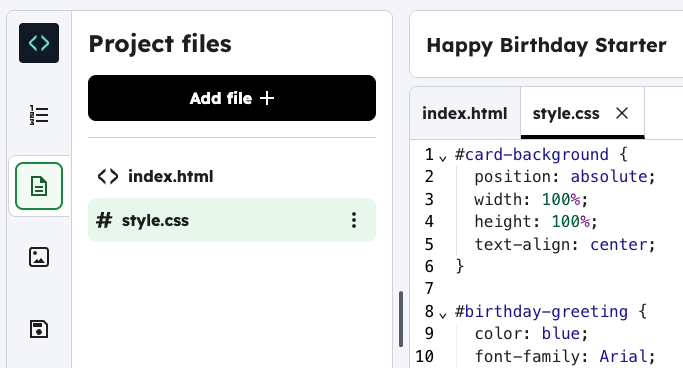
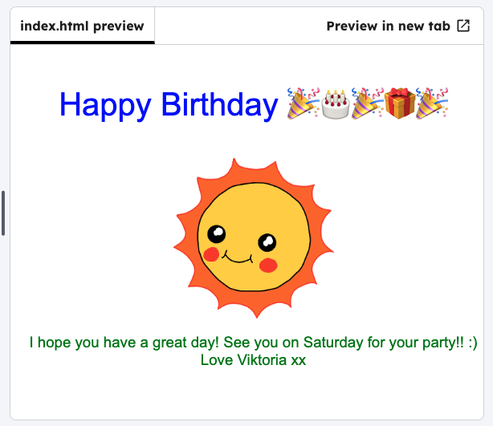

<h2 class="c-project-heading--task">Resize images</h2>

### Step 1

Change the size of the image with **CSS** code.

### Step 2

Click on the file icon and select the `style.css` file. 

### Step 3

Go to the `#pic` id in the CSS code. Change the `width` and `height` of the outside image to `200px` 

--- code ---
---
language: css
filename: style.css
line_numbers: true
line_number_start: 15
line_highlights: 16-17
---
#pic {
  width: 200px;
  height: 200px;
}
--- /code ---

### Step 4

Click **Run** to see the new size. Keep playing with the size until you are happy with how it looks.

### Tip

`px` stands for pixels, which is the small squares that make up digital images.

