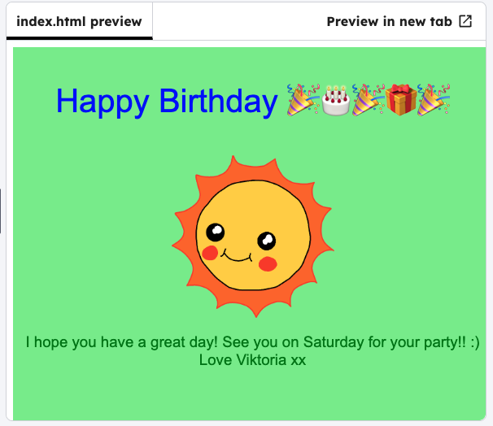

<h2 class="c-project-heading--task">Background colours</h2>

Experiment with colours for the background.

<h2 class="c-project-heading--explainer">Follow these instructions</h2>

## Step 1

In the CSS file, change the `background-color` to `lightgreen`.

--- code ---
---
language: css
filename: style.css
line_numbers: true
line_number_start: 1
line_highlights: 3
---
#card-background {
  position: absolute;
  background-color: lightgreen;  
  width: 100%;
  height: 100%;
  text-align: center;
}
--- /code ---

## Step 2

Click **Run** to see the background change. Experiment with adding other colours.

### Tip

You can find more CSS colour names [here](http://jumpto.cc/colours){:target="_blank"}.

## Now run your code

Click **Run** and check that the card background colour changes.
