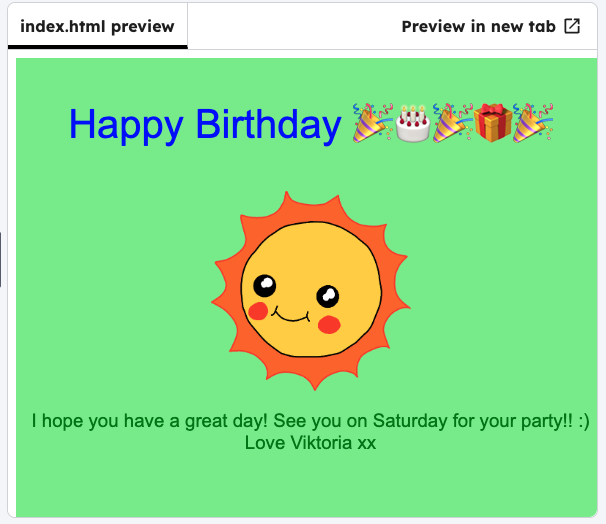

<h2 class="c-project-heading--task">Background colours</h2>

--- task ---

Experiment with colours for the background.

--- /task ---

--- task ---

In the CSS file, change the `background-color` to `lightgreen`.

--- /task ---

--- code ---
---
language: css
filename: style.css
line_numbers: true
line_number_start: 1
line_highlights: 4
---
#card-background {
  position: absolute;
  width: 100%;
  height: 100%;
  text-align: center;
}
--- /code ---
--- task ---

Click **Run** to see the background change. Experiment with adding other colours.

--- /task ---

