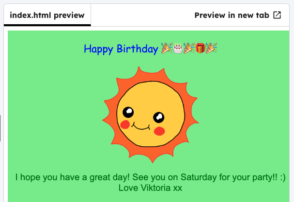

<h2 class="c-project-heading--task">Font style</h2>

--- task ---

Style the text with a different font and size.

--- /task ---

--- task ---

Change the `font-family` to `Comic Sans MS`. 

--- /task ---

--- task ---

You can make the font bigger by changing the `font-size` to `16pt`.

--- /task ---

--- code ---
---
language: css
filename: style.css
line_numbers: true
line_number_start: 16
line_highlights: 18, 19
---
#outside-title {
  color: black;
  font-family: Comic Sans MS;
  font-size: 16pt;
  text-align: center;
}
--- /code ---
--- task ---

Click **Run** and see the font change.

--- /task ---

--- task ---

Try adding other fonts, for example: `arial`, `impact`or `tahoma`.

--- /task ---